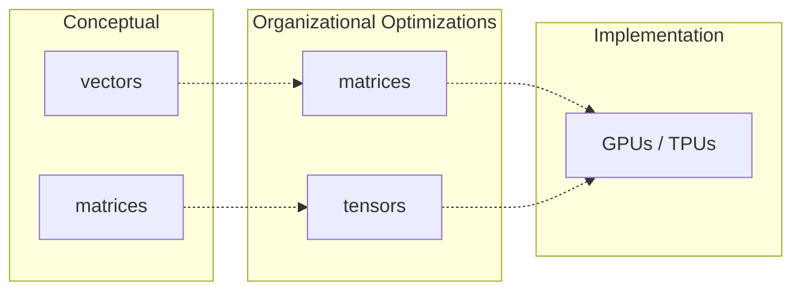
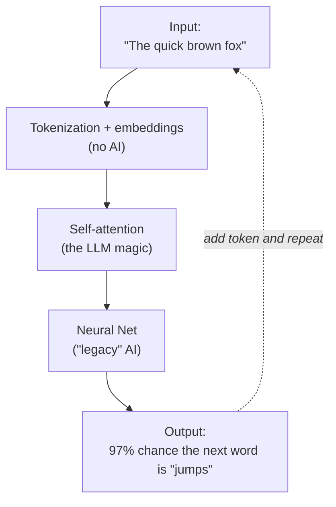

# Overview of LLMs

As you may have heard, LLMs are essentially "autocomplete on steroids": given a bunch of input text, they predict the next word. But how?

I think it's useful to think about LLMs in three layers:

1. The fundamental concepts
2. The organizational optimizations of those concepts
3. The actual implementation

This book will primarily focus on the first two layers, and ignore the third altogether. For implementation, you should refer to resources like [Sebastian Raschka's _Build a Large Language Model (From Scratch)_][Raschka] or [Hugging Face's course] (which I haven't read yet, but I hear good things about).

In the first layer (the conceptual layer) LLMs are mostly about **vectors**, with a small (but crucial!) smattering of **matrices**. Vectors are just sequences of numbers, and LLMs use them to encode basically anything that has nuance.

For example, the word "dog" carries a lot of nuance: it can be a noun (the animal) or a verb (to follow someone persistently), or an adjective (dog days). As a noun, it can be a pet, a service animal, or a hound of war. It can mean an ugly person or a scandalous person, either judgementally or affectionately ("you dog, you!"). It can mean some subtle thing that I don't even know how to think about, much less describe. **Vectors allow LLMs to encode all of this information.**

The second layer (optimizations) batches the conceptual vectors into matrices, and the conceptual matrices into **tensors** (don't worry if you don't know what those are). The underlying concepts are exactly the same: it just lets us represent the data in a way that GPUs and TPUs can crunch in parallel, and more efficiently than a CPU can.

## Components of an LLM

An LLM consists of a few key components:

- The tokenizer and embedding layer, which turn the input text into vectors that the LLM can reason about (remember the "dog" example from above)
- Self-attention, which tells the LLM how those token vectors relate to each other (this is the main innovation of LLMs as compared to previous AI)
- A deep learning neural net for processing the vectors

The output of all this is a probability distribution over every token the LLM knows about, representing how likely that token is to be the correct next token. The LLM then picks that most likely token, adds it to the text, and repeats the process with the new token added.

Don't worry if this doesn't all fit together yet, and especially don't worry if you don't know how those various subcomponents work (or even what they mean). I'll be explaining each in the following chapters. As you read those chapters, it may be useful to refer back to this diagram to see how it all fits together.

[Raschka]: https://www.manning.com/books/build-a-large-language-model-from-scratch
[Hugging Face's course]: https://huggingface.co/learn/llm-course/chapter1/1
