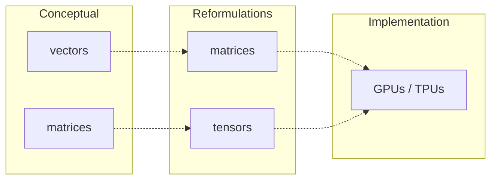

# The LLM's architecture

In the previous chapter, I gave a very high-level overview of how LLMs work. In the next few chapters, I’ll describe this architecture in much more detail. I’ll cover each component of an LLM --- what it does, why it’s needed, and the nitty-gritty math that drives it.

(conceptual-layers)=

## How I organize my thinking about LLMs

I find it useful to think about LLMs in three hierarchical perspectives:

1. The fundamental concepts
2. Algebraic reformulations of those concepts
3. The actual implementation

This book will primarily focus on the first two perspectives, and ignore the third altogether. For implementation, you should refer to resources like [Sebastian Raschka's _Build a Large Language Model (From Scratch)_][Raschka] or [Hugging Face's course] (which I haven't read, but I hear good things about).

:::{note} This is not standard terminology
The way I break down these perspectives --- and in particular, the separation between fundamental concepts and algebraic reformulations --- isn't standard. Most texts combine the concepts and algebraic formulations, which makes for a more streamlined description, but one that I find harder to follow.

If you read other materials on LLMs, just be aware that they'll likely combine perspectives 1 and 2 into just a single "here's what's going on".
:::

[Raschka]: https://www.manning.com/books/build-a-large-language-model-from-scratch
[Hugging Face's course]: https://huggingface.co/learn/llm-course/chapter1/1

### Conceptual perspective

In the first perspective (the conceptual perspective) data follows through the LLM in the form of vectors. In particular, we'll often work with vectors of vectors, like $[ [1, 2, 3], [4, 5, 6] ]$. To transform these vectors, we'll often use matrices.

### Algebraic reformulations

The second perspective (algebraic reformulations) batches the conceptual vectors into matrices, and then these matrices into tensors. The underlying concepts are exactly the same: the reformulations just let us represent the data in a way that GPUs and TPUs can crunch more efficiently than a CPU can.

:::{seealso} Why GPUs & TPUs?
:class: simple dropdown
GPUs are great at taking a ton of data (for example, the elements of a matrix) and applying the same logic to each data point in parallel; for example, they can do matrix multiplication in a single go, without having to loop over each cell.

TPUs (Tensor Processing Units) extend this by building in, at the hardware level, specific optimizations for matrix math.

This means that if we can express our data not as a bunch of separate vectors, but as a single matrix or tensor, we can process the data in parallel and with optimizations down to the hardware level.
:::

### This book's approach

In the following chapters, I'll explain LLMs in terms of that first perspective, the conceptual one. This will hopefully help you understand not just what's going on, but what motivates each part of the architecture. Each major component will be a separate chapter.

Once I've described all of the components, I'll spend one chapter describing how all the bits get boiled down to the algebraic reformulations.

## Components of an LLM

:::{div}
:label: llm-components
:class: content-group
An LLM consists of a few key components:

- The {dfn}`tokenizer` and {dfn}`embedding` layer, which turn the input text into vectors that the LLM can reason about (remember the "dog" example from [earlier](#vectors-are-nuance))
- {dfn}`Self-attention`, which tells the LLM how those token vectors relate to each other (this is the main innovation of LLMs as compared to previous AI models)
- A {dfn}`feedforward network (FFN)` for processing the vectors

The self-attention and FFN together form a {dfn}`transformer block`, and these blocks are the core of the LLM.

It's fine if you don't know what these terms mean. I explain them as we go.
:::

The output of all this is a probability distribution over every token (every "word", very roughly) that the LLM knows about, representing how likely that token is to be the correct next token. The LLM then picks that most likely token, adds it to the text, and repeats the process with the new token added.

:::{drawio} images/overview/llm-flow
:alt: "The quick brown fox" flows into the LLM, which predicts the next word is "jumps". Then, "the quick brown fox jumps" flows into the LLM, and so on.
:::

:::{important}
This is a simplified model that outlines the building blocks. Later, I'll describe how real-world LLMs stack these building blocks to make their models more powerful.
:::

## Hyperparameters, learned parameters, and activations

In addition to the components, it's important to keep separate in your head the three kinds of data an LLM works with: {dfn}`hyperparameters`, {dfn}`learned parameters` and {dfn}`activations`.

(parameter-vs-activation)=
hyperparameter
: A value decided by a human as part of the model's design, which basically determines the structure of the model. This includes how many hidden layers the feedforward network has, or how big the input embeddings are. (It's fine if you don't yet know what a hidden layer or input embedding is!)

learned parameter
: A value that's part of the LLM's model: it's learned during training, and is unchanged when the model's actually used. This is what the model knows about language in general.

activation:
: A value that's derived from the user's input. This combines that input with learned parameters. This is what the language is figuring out about your prompt specifically.

As I introduce various parts of the LLM, I'll be explicit about which kind of value each one is.

The following chapters will walk through each of the LLM's components, starting with the tokenizer and embedding layer.
