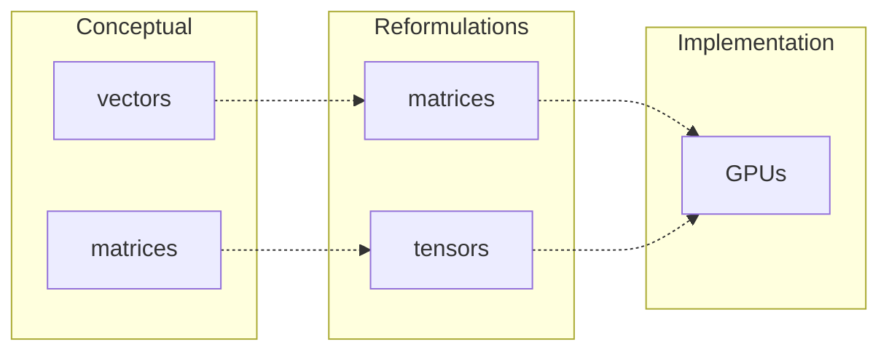

# Architectural overview

:::{status} 2
:::

In the previous chapter, I gave a very high-level overview of how LLMs work. In the next few chapters, I’ll describe this architecture in much more detail. I’ll cover each component of an LLM --- what it does, why it’s needed, and the nitty-gritty math that drives it.

(conceptual-layers)=

## How I organize my thinking about LLMs

I mentioned in the introduction that I think of the pedagogy of LLMs in three perspectives:

:::{embed} #pedagogical-hierarchy
:::

### Conceptual perspective

In the first perspective (the conceptual perspective) data follows through the LLM in the form of vectors. In particular, we'll often work with vectors of vectors, like $\begin{bmatrix}\small\,\begin{bmatrix}1 \; 2 \; 3\end{bmatrix}\;\begin{bmatrix}4 \; 5 \; 6\end{bmatrix}\,\end{bmatrix}$. To transform these vectors, we'll often use matrices.

### Algebraic reformulations

The second perspective (algebraic reformulations) batches the conceptual vectors into matrices, and then these matrices into tensors. The underlying concepts are exactly the same: the reformulations just let us represent the data in a way that GPUs can crunch more efficiently than a CPU can.

```mermaid
flowchart LR

  subgraph Concept[Conceptual]
    direction TB
    C1[vectors]
    C2[matrices]
  end

  subgraph Org[Reformulations]
    direction TB
    L1[matrices]
    L2[tensors]
  end

  subgraph Implementation
    direction TB
    Hardware[GPUs]
  end

  C1 -.-> L1 -.-> Hardware
  C2 -.-> L2 -.-> Hardware
  
```

:::{seealso} Why GPUs?
:class: simple dropdown
GPUs are great at taking a ton of data (for example, the elements of a matrix) and applying the same logic to each data point in parallel; for example, they can do matrix multiplication in a single go, without having to loop over each cell.

This means that if we can express our data not as a bunch of separate vectors, but as a single matrix or tensor, we can process the data in parallel and with optimizations down to the hardware level.
:::

### This book's approach

In the following chapters, I'll explain LLMs in terms of that first perspective, the conceptual one. This will hopefully help you understand not just what's going on, but what motivates each part of the architecture. Each major component will be a separate chapter.

Once I've described all of the components, I'll spend one chapter describing how all the bits get boiled down to the algebraic reformulations.

## Components of an LLM

:::{div}
:label: llm-components
:class: content-group
An LLM consists of a few key components:

- The {dfn}`tokenizer` and {dfn}`embedding` layer, which turn the input text into vectors that the LLM can reason about (remember the "dog" example from [earlier](#vectors-are-nuance))
- {dfn}`Self-attention`, which tells the LLM how those token vectors relate to each other (this is the main innovation of LLMs as compared to previous AI models)
- A {dfn}`feedforward network (FFN)` for processing the vectors

The self-attention and FFN together form a {dfn}`transformer block`, and these blocks are the core of the LLM.

It's fine if you don't know what these terms mean. I explain them as we go.
:::

The output of all this is a probability distribution over every token (every "word", very roughly) that the LLM knows about, representing how likely that token is to be the correct next token. The LLM then picks that most likely token, adds it to the text, and repeats the process with the new token added.

:::{drawio} images/overview/llm-flow
:alt: "The quick brown fox" flows into the LLM, which predicts the next word is "jumps". Then, "the quick brown fox jumps" flows into the LLM, and so on.
:::

:::{important}
This is a simplified model that outlines the building blocks. Later, I'll describe how real-world LLMs stack these building blocks to make their models more powerful.
:::

## Hyperparameters, learned parameters, and activations

In addition to the components, it's important to keep separate in your head the three kinds of data an LLM works with: {dfn}`hyperparameters`, {dfn}`learned parameters` and {dfn}`activations`.

(parameter-vs-activation)=
hyperparameter
: A value decided by a human as part of the model's design, which determines the structure of the model. This includes how many hidden layers the feedforward network has, or how big the input embeddings are. (Again, it's fine if you don't yet know what a hidden layer or input embedding is!)

learned parameter
: A number learned during training and then fixed when the model is used. These parameters encode what the model has learned.

activation:
: A value computed from the user's input and the learned parameters. This is what the model is figuring out about your prompt specifically.

By way of analogy, if an LLM were a simple equation like $y = kx^2$ for some fixed $k$, then:

- The fact that the equation is quadratic is a hyperparameter.
- If the model learns that $k = 2.7$ gives the best results, that 2.7 is a learned parameter.
- For an input of $x = 3.1$, the resulting 25.947 ($= 2.7 \times 3.1^2$) is the activation.

As I introduce various parts of the LLM, I'll be explicit about which kind of value each one is.
