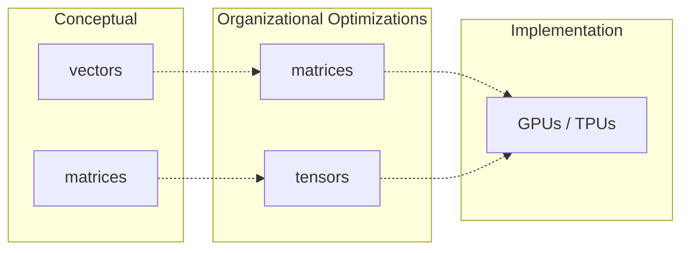

# Overview of LLMs

As you may have heard, LLMs are essentially "autocomplete on steroids": given a bunch of input text, they predict the next word. But how?

(conceptual-layers)=

## How I organize my thinking about LLMs

I find it useful to think about LLMs in three layers:

1. The fundamental concepts
2. Mathematical optimizations of those concepts
3. The actual implementation

This book will primarily focus on the first two layers, and ignore the third altogether. For implementation, you should refer to resources like [Sebastian Raschka's _Build a Large Language Model (From Scratch)_][Raschka] or [Hugging Face's course] (which I haven't read, but I hear good things about).

In the first layer (the conceptual layer) LLMs are mostly about vectors, with a small but crucial smattering of matrices.

(vectors-are-nuance)=
LLMs use vectors and matrices to encode basically anything that has nuance. For example, the word "dog" has many meanings: it can be a noun (the animal) or a verb (to follow someone persistently), or an adjective (dog days). It can be a pet, a service animal, or a hound of war. It can mean an ugly person or a scandalous person, either judgementally or affectionately ("you dog, you!"). It can mean some subtle thing that I don't even know how to think about, much less describe. **Vectors allow LLMs to encode all of this information.**

The second layer (mathematical optimizations) batches the conceptual vectors into matrices, and the conceptual matrices into tensors. The underlying concepts are exactly the same: it just lets us represent the data in a way that GPUs and TPUs can crunch in more efficiently than a CPU can.

:::{seealso} Why GPUs & TPUs?
:class: simple dropdown
In a nutshell: GPUs are great at taking a ton of data (for example, the elements of a matrix) and applying the same logic to each data point in parallel; for example, they can do matrix multiplication in a single go, without having to loop over each item. TPUs extend this by building in, at the hardware level, specific optimizations for matrix math. This means that if we can express our data not as a bunch of separate vectors, but as a single matrix or tensor, then the right hardware can process the data in parallel and with optimizations down to the hardware level.
:::

Within each of the following chapters, I'll start by explaining an aspect of the LLM in terms of the fundamental concept. Then, I'll touch briefly on how that translates to the mathematical optimizations.

## Components of an LLM

An LLM consists of a few key components:

- The tokenizer and embedding layer, which turn the input text into vectors that the LLM can reason about (remember the "dog" example from above)
- Self-attention, which tells the LLM how those token vectors relate to each other (this is the main innovation of LLMs as compared to previous AI)
- A deep learning neural net for processing the vectors

The output of all this is a probability distribution over every token the LLM knows about, representing how likely that token is to be the correct next token. The LLM then picks that most likely token, adds it to the text, and repeats the process with the new token added.

{drawio}`images/03/llm-flow`

:::{important}
This is a simplified model that outlines the building blocks. In @07-beyond-toy, I'll describe how real-world LLMs stack these building blocks to make their models more powerful.
:::

Don't worry if this doesn't all fit together yet, and especially don't worry if you don't know how those various subcomponents work (or even what they mean). I'll be explaining each in the following chapters. As you read those chapters, it may be useful to refer back to this diagram to see how it all fits together.

## Hyperparameters, learned parameters, and activations

In addition to the components, it's important to keep separate in your head the three kinds of data an LLM works with: {dfn}`hyperparameters`, {dfn}`learned parameters` and {dfn}`activations`.

(parameter-vs-activation)=
hyperparameter
: A value decided by a human as part of the model's design, which basically determines the structure of the model. This includes how many hidden layers the neural network has, or the dimensionality of the input embeddings. (It's fine if you don't yet know what a hidden layer or input embedding is!)

learned parameter
: A value that's part of the LLM's model: it's learned during training, but then is unchanged when the model's actually used. This is what the model knows about language in general.

activation:
: A value that's derived from the user's input. This combines that input with learned parameters. This is what the language is figuring out about your prompt specifically.

(what-are-learned-parameters)=

### Training and inference

An LLM, like any machine learning model, has two basic modes:

(training-vs-inference)=

training
: The model is learning the values of its trained parameters. This is part of creating the model.

inference
: The model is using what it learned. This is the mode you interact with when you use the model.

## What do learned parameters mean?

It's natural to ask: where do these learned parameters come from, and what do they represent?

Thinking back to the previous example, I mentioned that the word "dog" can have lots of meanings. In the tokenization and embedding portion of the LLM, each of these meanings corresponds to an element within a vector (the "embedding vector", which I'll describe in @02-input-to-vectors). Those values are the learned parameters for that vector.

But what do these actually represent? Basically nothing that corresponds to human intuition. I've been saying that the values represent things like "dog can be a pet", but it's really more of "dog has a high value for property 621 in the embedding vector", where property 621 is... something which, in practice, tends to correlate with the right prediction for the next token. I find it helpful to think of it as "pet-ness" _by way of analogy_, but remember that the analogy is imperfect. This will be even more stark when we run the vectors through the deep learning neural net.

So far, I've been talking about the word "dog," and its token embedding vector. But there are other pieces of information: the fact that "dog" is the ninth word in "the quick brown fox jumps over the lazy dog"; the fact that this is a common expression; the fact that a fox and a dog are both animals; the fact that referencing an animal in one part of the sentence makes it likely you'll reference another animal later; and so on. Each of these is a different vector, in a different part of the LLM. And again, each of these meanings is only an analogy.

The values themselves are emergent properties that arise over many training rounds, over a large corpus of text. Through the magic of partial derivatives and some other math tricks, all the learned parameters in the LLM naturally settle into useful values.

Gaining insight into what those values really "mean," and how we can understand or even audit them, is well outside the scope of this book. This is an area of active research (and is one of the things that Anthropic specifically works hard at).

There are a _lot_ of these learned parameters. A typical high-quality LLM (ChatGPT, Claude, etc) will have hundreds of billions of them. A small model that you can run on your laptop may have "only" 5 - 15 billion.

### An analogy

I'll describe training in more detail [later](./06-training.md), but it may help demystify things a bit if I touch on it now. I mentioned above that the learned parameters are emergent properties. How do they emerge, and how can they possibly mean anything if we didn't tell them what to mean?

A metaphor may be helpful here.

Imagine that a language's underlying structure can be represented by a subtly stretchy fabric. Our goal is to find where that fabric's strong and weak strands are, and in particular to figure out the pattern of those strong and weak points. If we can do that, then when someone gives us a small piece of similar fabric, we can extrapolate a larger tapestry from it. Crucially, we don't know _how_ this fabric represents the language: all we know is that it does.

To start, we'll sprinkle a fine sand evenly over the surface. At this point, we still don't know anything about the fabric. But, randomness being what it is, some grains will have ended up slightly clumped near weak spots in the fabric, causing those areas to very slightly, imperceptibly, sag.

Now, we'll bump the surface softly on the left; this represents a round of training. This moves the grains of sand in a not-quite-random way: They generally move rightward (this represents training bias), but more importantly, they'll also fall a bit towards whatever sag in the fabric they're closest to.

Next, we bump the surface softly on the right; and then on the top; and then the bottom, and every which way. Slowly but surely, the training biases cancel out, the effects of the sagging compound, and we get a sense of the fabric's composition. The weaker the spot in the fabric, the more the sand will accumulate and the more that area will sag.

In this metaphor, each sand-filled sag represents a learned parameter, and the amount of sand in it represents the parameter's value.

Note that the sags we find aren't the true structure of the fabric (or, by way of analogy, the language's structure). They're one view of it, which we discovered via a randomized process. If we were to clear the surface and start again with a fresh sprinkling or slightly different jostles, we might get a different set of sags. But both end results represent the same thing: an approximation of the fabric's true structure, which we can then use to generate more fabric.

## In summary

- everything is a vector or a matrix
- these vectors and matrices encode the nuances of human language
- each vector or matrix encodes a different aspect of those nuances
- the nuances aren't ones we'd understand; they're abstract mathematical properties that are only analogous to the kinds of categories we'd come up with
- it can't be stressed enough: _everything is a vector_ (or a matrix)

With that, let's get into it. We'll start with a refresher on what vectors and matrices are, and the handful of mathematical operations we'll need to use on them.

[Raschka]: https://www.manning.com/books/build-a-large-language-model-from-scratch
[Hugging Face's course]: https://huggingface.co/learn/llm-course/chapter1/1
