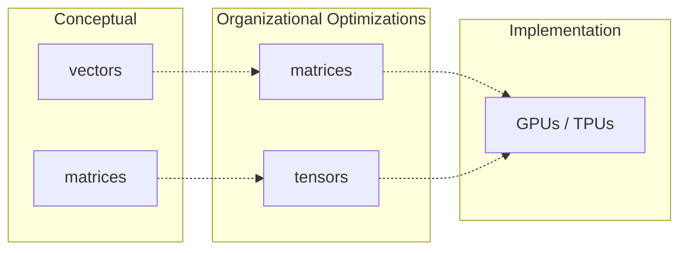
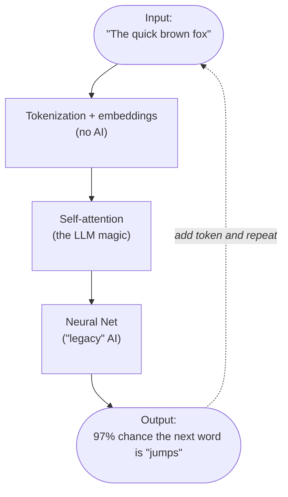

# Overview of LLMs

As you may have heard, LLMs are essentially "autocomplete on steroids": given a bunch of input text, they predict the next word. But how?

(conceptual-layers)=

## How I organize my thinking about LLMs

I find it useful to think about LLMs in three layers:

1. The fundamental concepts
2. Mathematical optimizations of those concepts
3. The actual implementation

This book will primarily focus on the first two layers, and ignore the third altogether. For implementation, you should refer to resources like [Sebastian Raschka's _Build a Large Language Model (From Scratch)_][Raschka] or [Hugging Face's course] (which I haven't read, but I hear good things about).

In the first layer (the conceptual layer) LLMs are mostly about **vectors**, with a small but crucial smattering of **matrices**. The next chapter contains a quick refresher on what you need to know about those.

LLMs use vectors and matrices to encode basically anything that has nuance. For example, the word "dog" has many meanings: it can be a noun (the animal) or a verb (to follow someone persistently), or an adjective (dog days). It can be a pet, a service animal, or a hound of war. It can mean an ugly person or a scandalous person, either judgementally or affectionately ("you dog, you!"). It can mean some subtle thing that I don't even know how to think about, much less describe. **Vectors allow LLMs to encode all of this information.**

The second layer (mathematical optimizations) batches the conceptual vectors into matrices, and the conceptual matrices into **tensors** (don't worry if you don't know what those are). The underlying concepts are exactly the same: it just lets us represent the data in a way that GPUs and TPUs can crunch in more efficiently than a CPU can.

## Components of an LLM

An LLM consists of a few key components:

- The tokenizer and embedding layer, which turn the input text into vectors that the LLM can reason about (remember the "dog" example from above)
- Self-attention, which tells the LLM how those token vectors relate to each other (this is the main innovation of LLMs as compared to previous AI)
- A deep learning neural net for processing the vectors

The output of all this is a probability distribution over every token the LLM knows about, representing how likely that token is to be the correct next token. The LLM then picks that most likely token, adds it to the text, and repeats the process with the new token added.

Don't worry if this doesn't all fit together yet, and especially don't worry if you don't know how those various subcomponents work (or even what they mean). I'll be explaining each in the following chapters. As you read those chapters, it may be useful to refer back to this diagram to see how it all fits together.

(what-are-learned-parameters)=

## High level: What's in these components?

Other than the input and output components in the description above, all of the other components make extensive use of **learned parameters**. These are values within the respective vectors (and matrices) that tell the LLM how important that element is, within a given context.

Thinking back to the previous example, I mentioned that the word "dog" can have lots of meanings. In the tokenization and embedding portion of the LLM, each of these meanings corresponds to an element within a vector (the "embedding vector", which I'll describe in @04-input-to-vectors). Those values are the learned parameters for that vector.

What do these actually represent? Basically nothing that corresponds to human intuition. I've been saying that the values represent things like "dog can be a pet", but it's really more of "dog has a high value for property 621 in the embedding vector", where property 621 is... something which, in practice, tends to correlate with the right prediction for the next token. I find it helpful to think of it as "pet-ness" _by way of analogy_, but remember that the analogy is imperfect. This will be even more stark when we run the vectors through the deep learning neural net.

So far, I've been talking about the word "dog," and its token embedding vector. But there are other pieces of information: the fact that "dog" is the ninth word in "the quick brown fox jumps over the lazy dog"; the fact that this is a common expression; the fact that a fox and a dog are both animals; the fact that referencing an animal in one part of the sentence makes it likely you'll reference another animal later; and so on. Each of these is a different vector, in a different part of the LLM. And again, each of these meanings is only an analogy.

The values themselves are emergent properties that arise over many training rounds, over a large corpus of text. Through the magic of partial derivatives and some other math tricks, all the learned parameters in the LLM naturally settle into useful values.

Gaining insight into what those values really "mean," and how we can understand or even audit them, is well outside the scope of this book. This is an area of active research (and is one of the things that Anthropic specifically works hard at).

There are a _lot_ of these learned parameters. A typical high-quality LLM (ChatGPT, Claude, etc) will have hundreds of billions of them. A small model that you can run on your laptop may have "only" 5 - 15 billion.

### Preview of how training works

I'll describe training in more detail [later](./07-training.md), but it may help demystify things a bit if I touch on it now.

:::{important}
To be clear, this section should be _very_ much understood as allegory.
:::

When a particular vector first starts out in the model, it's given random values. At this point, it doesn't matter what the values are; just that they're all different, and thus will "nudge" in different ways to the same input. Think of these as grains of sand evenly distributed on a bumpy surface: when you bump the surface, each grain will jostle slightly into whatever valley it's closest to. When you shake the surface enough, eventually the sand won't be evenly distributed at all, but will instead follow the contours of the surface's bumps. That lets us then understand the surface; that's what we want.

Let's dig very slightly into the details.

At every training pass we'll have some input and a known output. For example, we can take the sentence "I like to ski when it snows" and break it into an input of "I like to ski when it" and an expected output of "snows".

We'll take this input and feed it into the model. The result will be all of the words in the model knows, each with the probability that it's the right next word. Ideally, for this input, the model should predict that "snows" has a high probability. But initially, the model is random, so it won't.

Instead, we'll have a probability for "snows" that's pretty far off from the expected value. We'll then go through the model and perform **backpropagation**, which basically asks: "for every parameter in the model, how would you have to adjust it, holding the rest of the parameters constant, for 'snows' to have a higher probability?" It then applies all of those learnings — and there you go, that's one jostle of the surface.

Over time, each of these jostles either reinforce each other or cancel each other out. That's just random at first, but as the valleys become deeper, they start to self-reinforce and become something the model has learned. Again, we don't know what the model's "valleys" really mean; we certainly don't know where they are. But the initial randomness plus repeated training rounds causes them to pop into existence through emergent behavior, and if we built our model well, the patterns those valleys describe will let us generate text.

## In summary

- everything is a vector or a matrix
- these vectors and matrices encode the nuances of human language
- each vector or matrix encodes a different aspect of those nuances
- the nuances aren't ones we'd understand; they're abstract mathematical properties that are only analogous to the kinds of categories we'd come up with
- it can't be stressed enough: _everything is a vector_ (or a matrix)

With that, let's get into it. We'll start with a refresher on what vectors and matrices are, and the handful of mathematical operations we'll need to use on them.

[Raschka]: https://www.manning.com/books/build-a-large-language-model-from-scratch
[Hugging Face's course]: https://huggingface.co/learn/llm-course/chapter1/1
