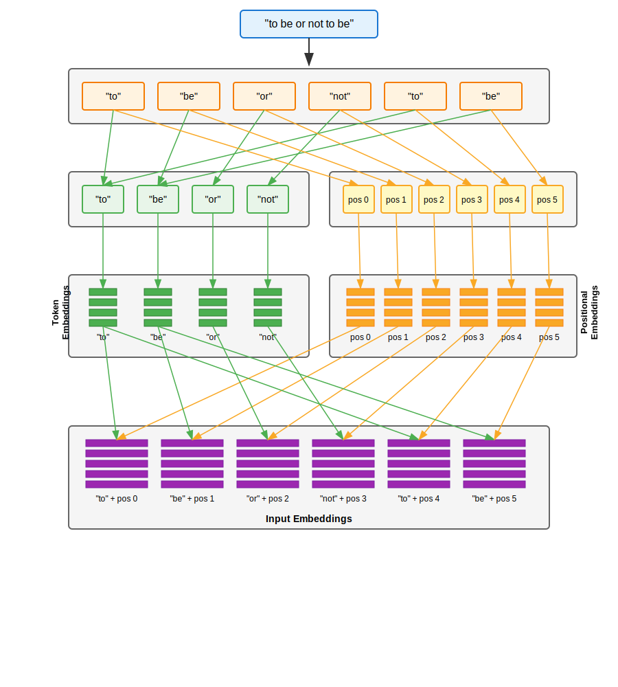

# Turning input text into vectors

## Overview

As I've mentioned before, vectors are how LLMs encode the nuance of human language. So, the first thing we need to do is to turn each part of the text input into a vector. In the end, we'll have one vector per token in the input text.

We'll be doing this in four steps:

1. Tokenizing the input
2. Generating **embedding vectors** for each unique token
3. Generating **positional vectors** for each position
4. Combining these into the **input embedding** vectors, one for each token in the input text.

   These input embeddings are what go onto the next component of the LLM (@05-self-attention).

As I mentioned in @conceptual-layers, I like to think about LLMs in terms of the fundamental concepts, and then the mathematical optimizations. I'll do that here.

## Fundamental concept of input embedding

### Going from input text to input embeddings

Let's take "to be or not to be" as an example. Here's how we go from the text, to the token embeddings and positional embeddings, to the input embeddings:

We start with the input text, which we just parse into tokens. I won't cover the tokenization algorithm itself; suffice it to say that the most common form of tokenization is byte pair encoding (BPE), which basically looks for words, sub-words (like the "de" in "demystify"), and punctuation. You can read about it [on Wikipedia][bpe], but since it's not really an AI concept (it was originally invented for compression!), it's not particularly interesting for us.

From there, each unique token gets a vector, which is the token embedding. This vector is the same for every instance of that token across the LLM, and represents what the token "means" on its own. For example, "to" has a certain (wide!) range of meanings.

Separately, each token _position_ in the input text gets a vector, which is the positional embedding. Again, this vector is the same for every position across the LLM: "the token at position 0" always has the same embedding, for example. Similar to the token embedding, this represents what it "means" to be the first, second, third, and so on, token in the input.

Finally, we combine the token embeddings and positional embeddings into the input embeddings. This now encapsulates what we know about the input text, absent any analysis of it (which will be the topic of the next chapters). For example, we have encoded that the input starts with "'to' as the first token of an input". We can do this with simple addition.

### But what are the values in all these vectors?

As mentioned in @what-are-learned-parameters, these values are just values that emerge through training. If we intuitively think of the various aspects of the word "be" — that it can be a semantically light auxiliary verb, that it can denote existence, that it's used in philosophical existentialism, and so on — then each of these is, very roughly by way of an analogy, a value in the token embedding vector. For example, item 318 in the embedding vector for "be" may encode its existential connotation. These values are particular to each token: an item in the same index 318 for "dog"'s embedding vector may connote fluffiness.

Again it's important to remember that the values don't _actually_ encode existentialism or fluffiness. They're just values which settle into being during training, and which correlate with predictive power when generating words.

The same is true for the positional embeddings, and by extension the input embeddings.

## Mathematical optimizations

So far, we have a bunch of vectors:

- token embeddings are vectors; and we have one per token
- positional embeddings are vectors; and we have one per position
- input embeddings are vectors; and we have one per token in the input text

We can group these into matrices. For example:

$$
\begin{array}{llllll}
\text{to} &  [ & 1.32, & 5.91, & 5.71, & \dots] \\
\text{be} &  [ & 6.16, & 4.81, & 3.62, & \dots] \\
\text{or} &  [ & 8.27, & 9.53, & 2.44, & \dots] \\
\text{...} & [ & \dots, & \dots, & \dots, & \dots]
\end{array}
\quad \Longrightarrow \quad
\begin{bmatrix}
1.32 & 5.91 & 5.71 & \dots \\
6.16 & 4.81 & 3.62 & \dots \\
8.27 & 9.53 & 2.44 & \dots \\
\dots & \dots & \dots & \dots
\end{bmatrix}
$$

We can do the same thing for the positional embeddings, and then the input embeddings.

Furthermore, during training we often want to work with batches of inputs at the same time. To do that, we just raise these matrices to rank 3 tensors, where one index represents the input with the batch of inputs, and the other two represent the matrix. Again, we do this for the token embeddings, positional embeddings, and input embeddings.

[bpe]: https://en.wikipedia.org/wiki/Byte-pair_encoding
